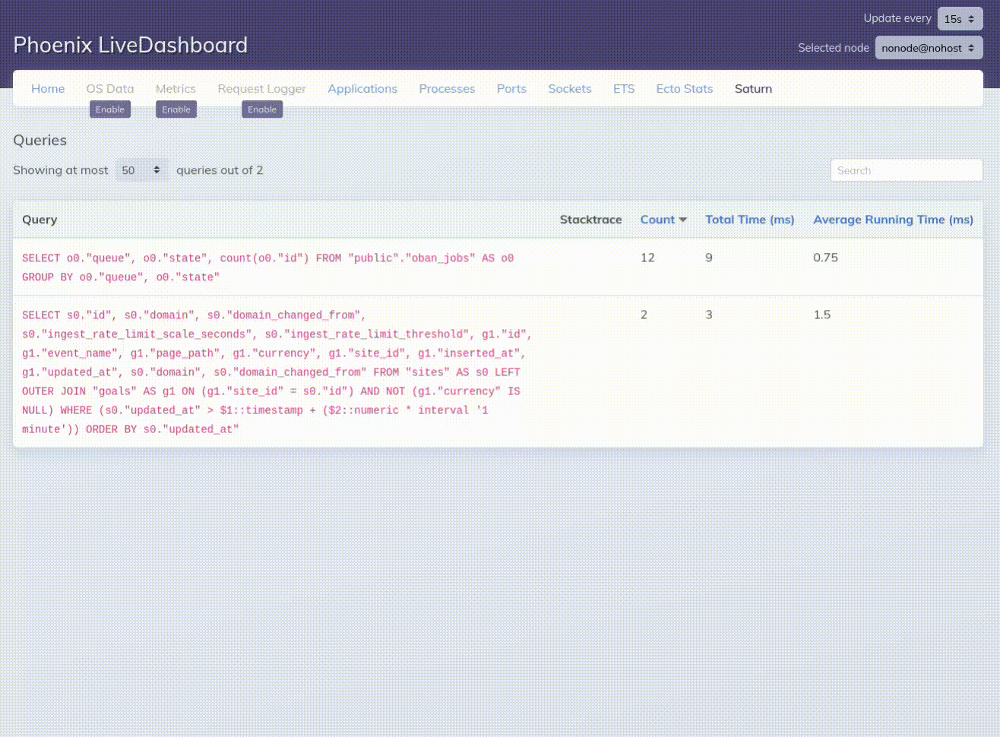

# SaturnPhoenix

Display [Saturn]-gathered query statistics in the [Phoenix LiveDashboard].



## Installation

First, you'll need to [install and configure Saturn]

The package can be installed by adding `saturn_phoenix` to your list of dependencies in `mix.exs`:

```elixir
def deps do
  [
    {:saturn_phoenix, git: "git@github.com:instinctscience/saturn_phoenix"}
  ]
end
```

Next, you'll need to configure the live dashboard to show the Saturn query page.  In your `router.ex` file, you should have a section that looks like this:

```elixir
    live_dashboard "/",
      metrics: MyApp.Web.Telemetry,
      ecto_repos: [MyApp.Repo]
```

You'll want to add `saturn: SaturnPhoenix.QueriesPage` to the list after an `additional_pages:`, like so:

```elixir
    live_dashboard "/",
      metrics: MyApp.Web.Telemetry,
      ecto_repos: [MyApp.Repo],
      additional_pages: [
	    saturn: SaturnPhoenix.QueriesPage
      ]
```

Now when you visit your Live Dashboard, you should see a new "Saturn" tab.  Install complete!

[Saturn]: https://github.com/instinctscience/saturn
[Phoenix LiveDashboard]: https://hexdocs.pm/phoenix_live_dashboard/Phoenix.LiveDashboard.html
[install and configure Saturn]: https://github.com/instinctscience/saturn#installation
